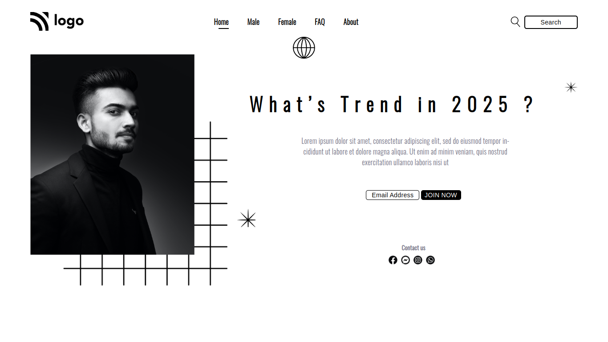

# Assignment 1

## Project 1 [Link](https://abhisek-project1-0a1226.netlify.app/)

- what i learn
  - Pseudo classes like `:before`, `:after`, `:nth-child`
  - Learnd to use css position [Relative & Absolute] property.

## Time Taken:

- 3h to complete.

